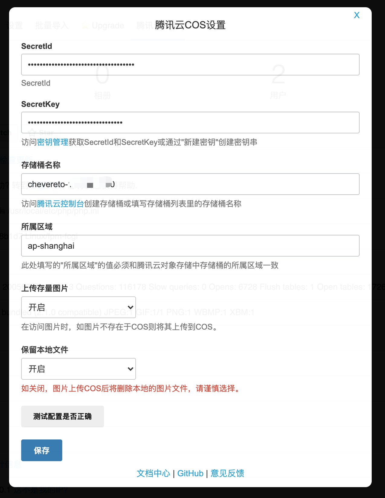

# 腾讯云对象存储

## 1.介绍

> 将Chevereto用户上传图片存储到的腾讯云对象存储（COS）中。

| 标题       | 名称                                                                                                |
| -------- | ------------------------------------------------------------------------------------------------- |
| 中文名称     | 腾讯云对象存储（COS）插件                                                                                  |
| 英文名称     | tencentcloud-chevereto-cos                                                                             |
| 最新版本     | 1.0.0 (2020.09.18)                                                                                |
| 适用平台     | [Chevereto](https://chevereto.com/)                                                               |
| 适用产品     | [腾讯云对象存储（COS）](https://cloud.tencent.com/product/cos)                                             |
| 主创团队     | 腾讯云中小企业产品中心（SMB Product Center of Tencent Cloud）                                                  |

## 2.功能特性

- 将Chevereto用户上传图片存储到的腾讯云对象存储（COS）中

## 3.安装指引

### 3.1.部署方式

### 3.1.部署方式一：通过GitHub部署安装

> 1. git clone [git@github.com:Tencent-Cloud-Plugins/tencentcloud-chevereto-plugin-cos.git](https://github.com/Tencent-Cloud-Plugins/tencentcloud-chevereto-cos.git)
> 2. 复制tencentcloud-chevereto-plugin-cos目录中的chevereto-hook.php文件和tencentcloud文件夹到Chevereto安装目录/app文件夹里面

## 4.使用指引

### 4.1.界面功能介绍

> 进入Cheveteto 仪表盘, 对腾讯云COS进行配置。配置介绍请参考下方的[名词解释](#_4-2-名词解释)

### 4.2.名词解释

- **SecretId**：在腾讯云云平台API密钥上申请的标识身份的 SecretId。详情参考[腾讯云文档](https://cloud.tencent.com/document/product)
- **SecretKey**：在腾讯云云平台API密钥上申请的标识身份的SecretId对应的SecretKey。详情参考[腾讯云文档](https://cloud.tencent.com/document/product)
- **存储桶名称**：COS服务中存储桶的名称。详情参考[腾讯云文档](https://cloud.tencent.com/document/product/436/41153)
- **所属区域**：存储桶基本信息中的所属地域（以ap-开头）。详情参考[腾讯云文档](https://cloud.tencent.com/document/product/436/6224)

## 5.FAQ

> 1. Q: 支持上传的头像图片吗？
>    
>    A：目前仅支持用户上传的图片。不支持设置的头像和设置的背景图片
>    
> 2. Q: 为什么COS上的图片没有加上水印？
>       
>    A：目前COS上仅保留原始图片。不包含水印图片和.md,.th等Chevereto生成的缩略图

## 6.版本迭代记录

- 将Chevereto用户上传图片存储到的腾讯云对象存储（COS）中
---

本项目由腾讯云中小企业产品中心建设和维护，了解与该插件使用相关的更多信息，请访问[春雨文档中心](https://openapp.qq.com/docs/Chevereto/cos.html) 

请通过[咨询建议](https://support.qq.com/products/164613) 向我们提交宝贵意见。